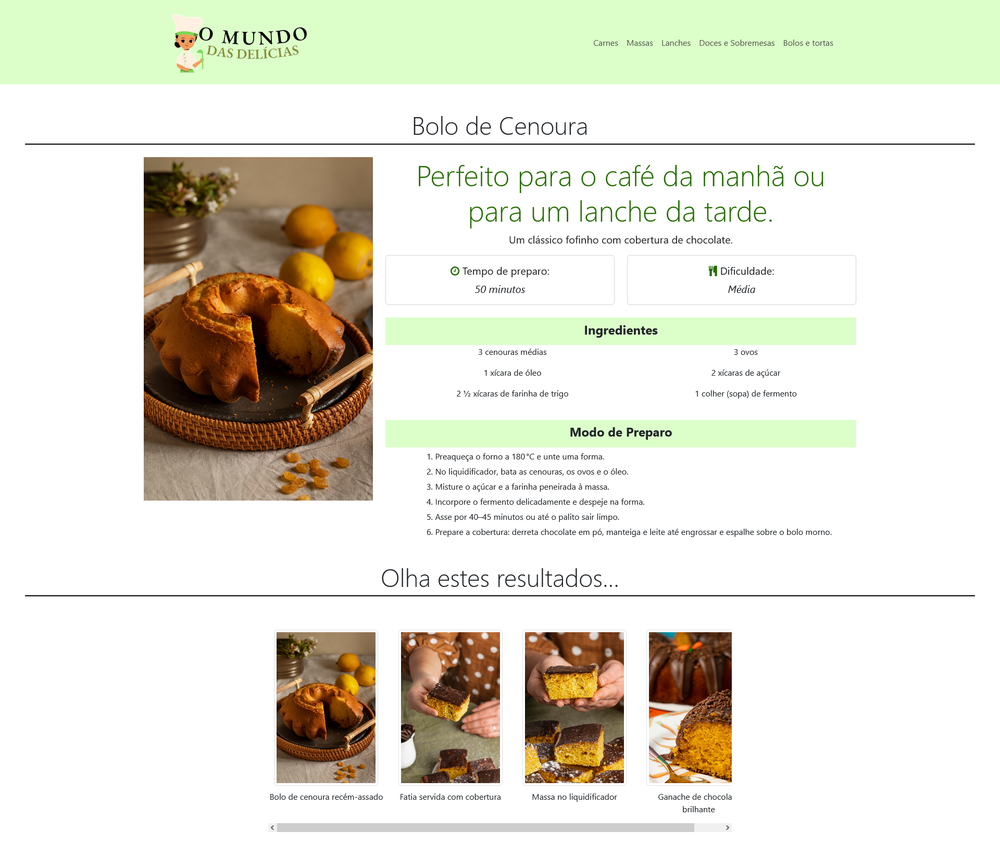

# Trabalho-Pratico-1

Este é um trabalho feito para a disciplina de Desenvolvimento de Interfaces Web,
no primeiro período do curso de Ciência da Computação.

<b>Breve descrição sobre o projeto:</b> O projeto é um diretório de receitas, que contém uma aba com categorias para facilitar a navegação, uma área de destaques, uma seção de últimos posts. Além disso, haverá botões para marcar as receitas como favoritas, e futuramente, terá um local para login, para salvar receitas favoritadas. Há páginas que com detalhes e passo a passo de cada receita presente no site.

## Imagens do Projeto

### Página Inicial

### Página de detalhes
